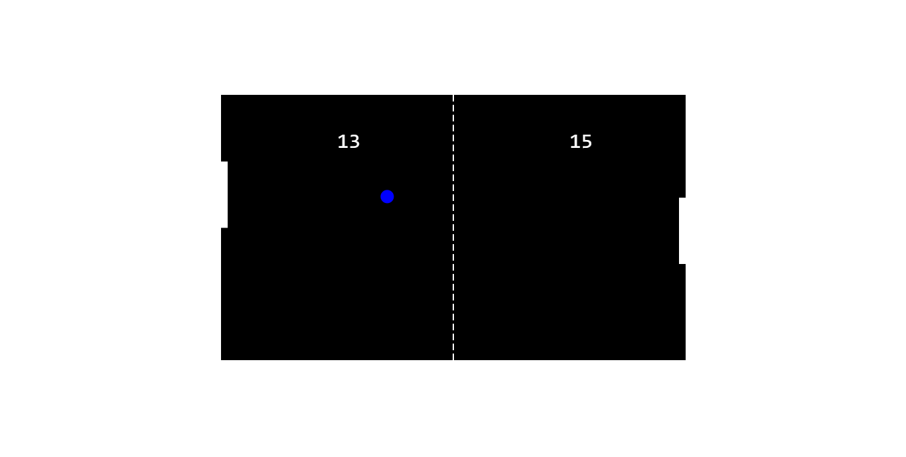

<h1 align="center">PingPong.js</h1>

<p align="center">
  <i>The library PingPong.js helps you to make an Ping Pong game easily</i>
</p>

<p align="center">
  <a href="./CONTRIBUTING.md">Contributing</a>
  ·
  <a href="https://github.com/ZhengLinLei/PingPong.js/issues">Issues</a>
</p>

<p align="center">
  <a href="https://opensource.org/licenses/Apache-2.0">
    
  </a>&nbsp;
  <a>
    
  </a>&nbsp;
  <a>
    
  </a>
</p>

<hr>


A example website [here](https://zhenglinlei.github.io/PingPong.js/tutorial/)




## Index

Learn how to use this library

- [Content](#content)
- [Getting Started](#gettingstarted)
- [Examples](#examples)


## <a name="content"></a> Content

Before getting started to your game it is necessary to know what includes in this repository.

You can view code examples in `./tutorial` folder, and the source code in `./src` folder. The minified project files are in the `./src/PingPong.min.js` file:

*Main file*
``
./src/PingPong.min.js
``


## <a name="gettingstarted"></a> Getting Started

#### Guide

**Method**
- [class.init()](#class.init)
- [class.pause()](#class.pause)
- [class.reset()](#class.reset)


**Unfortunately we do not have a CDN, but you can clone the repo and use it in local**


### 1. Create a canvas element in body tag

```html
<body>
    <canvas></canvas>
</body>
```

### 2. Firstly add the script to your project 

```html
<script src="./src/PingPong.min.js"></script>
```


### 3. Create a varible with the class

In your JS file or inner script tag, create a variable.
```javascript
const element = document.querySelector('canvas'); // CANVAS ELEMENT

const params = {} // USE DEFAULT PARAMS

const pingpong = new PingPong(element, params);
```

The params where you can use are (more info in file `./src/params.js`):
```javascript
const PingPongParams = {

    controls: ['keyboard'], // HOW TO CONTROL THE PADDLE

    // AVALIABLE OPTIONS
    // 
    // keyboard, mouse, touch

    bot: 'Bot', // TWO VALUES AVALIABLES: 'Random' and 'Bot'
    botVelocity: 5, // IN CASE YOU CHOOSE 'Random' YOU MUST TO SPECIFY THE VELOCITY

    canvas: {
        height: 400, // THE HEIGHT OF THE CANVAS
        width: 700, // THE WIDTH OF THE CANVAS
        color: '#fff', // THE BACKGROUND OF THE CANVAS
        orientation: 'horizontal' // FOR MOBILE DEVICES CHOOSE VERTICAL orientation: 'vertical'
    },

    paddle: {
        width: 10, // WIDTH OF THE PADDLE
        height: 100, // HEIGHT OF THE PADDLE
        color: '#fff' // THE COLOR OF THE PADDLE
    },

    net: {
        width: 2,
        height: 10, // THE HEIGHT OF EVERY MINI RECTANGLES
        space: 15, // THE EMPTY SPACE FOR EVERY MINI RECTANGLES OF THE NET
        color: '#fff'
    },

    ball: {
        radius: 10, // THE WIDTH & HEIGHT ( radius ) OF THE BALL
        color: '#ff0000', // COLOR OF THE BALL
        velocity: [5, 5], // VELOCITY ARRAY [x, y]
        speed: 5, // CONSTANT VELOCITY THAT IS NOT A VECTOR, THAT MEANS THIS VALUE DIDN'T HAVE DIRECTION
        acceleration: 0.1 // EVERY TIMES WHEN THE BALL COLLIDE THE PADDLES ADD THIS ACCELERATION, IF YOU WANT MAKE NEUTRAL PUT 0 OR NEGATIVE FOR SLOW DOWN BUT WHEN THE BALL SPEED BECOME 0 THE BALL WILL MAKE NEGATIVE VELOCITY
    },

    scores: {
        fontSize: 32, // THE FONTSIZE OF THE NUMBER SCORE IN PX
        fontFamily: 'Consolas', // FONTFAMILY MUST BE ONE THAT EVERY COMPUTER HAVE IT LIKE ARIAL
        color: '#fff' // COLOR OF THE NUMBER
    }
}
```


### <a name="class.init"></a> 4. Start the game

For start the game call the method `class.init()`
```javascript
pingpong.init();

// WITH START BUTTON
element.addEventListener('click', () => {
    // CALL START
    pingpong.init();
});
```


### <a name="class.pause"></a> 5. Pause the game

You can pause the game using this method `class.pause()`
```javascript
pingpong.pause();

// WITH PAUSE BUTTON
element.addEventListener('click', () => {
    // CALL PAUSE
    pingpong.pause();
});
```


### <a name="class.reset"></a> 6. Pause the game

This method will reset the game
```javascript
pingpong.reset();

// Output (boolean)
//
// true
```

### More functions

This version is a initial version, in the future may the library have news features.


## <a name="example"></a> Example

```html
<body>
    <canvas></canvas>
    <button id="start">Play the game</button>
    <button id="pause">Pause the game</button>


    <script src="../src/PingPong.min.js"></script>
</body>
```

```javascript
const canvas = document.querySelector('canvas');
const params = {

    controls: ['keyboard', 'mouse', 'touch'], // ENABLE THE CONTROLS OPTIONS
    ball: {
        color: 'blue' // WANT A BLUE COLOR BALL
    }

}

var pingpong = new PingPong(canvas, params);


// PLAY
const startBtn = document.querySelector('#start');
startBtn.addEventListener('click', ()=>{
    pingpong.init();
});

// PAUSE
const pauseBtn = document.querySelector('#pause');
pauseBtn.addEventListener('click', ()=>{
    pingpong.pause();
});
```


## Images


### Love this repo? Give us a star ⭐

<a href="./">
  
</a>